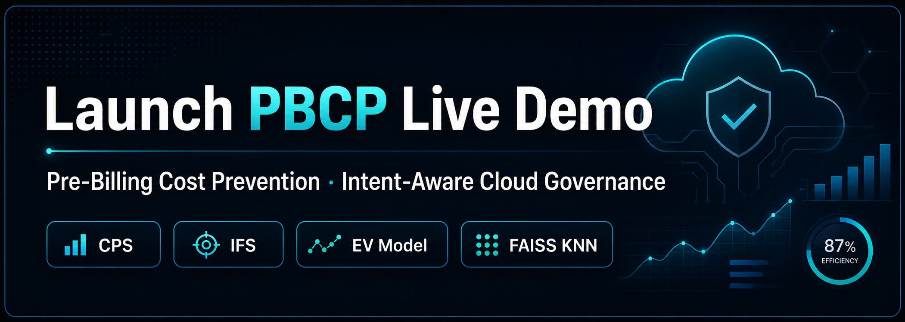
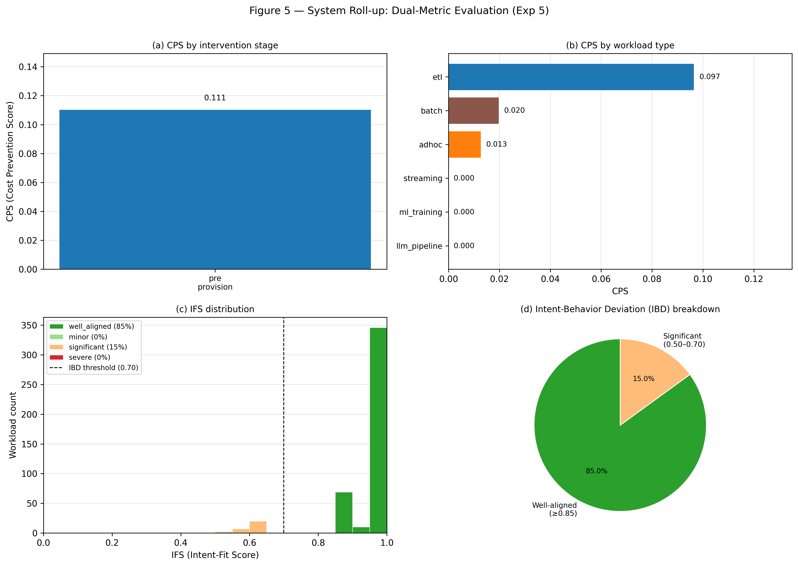
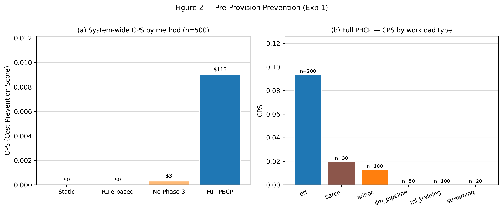
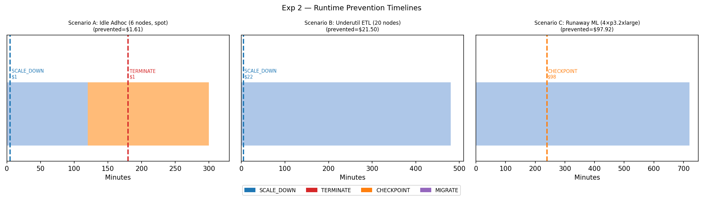
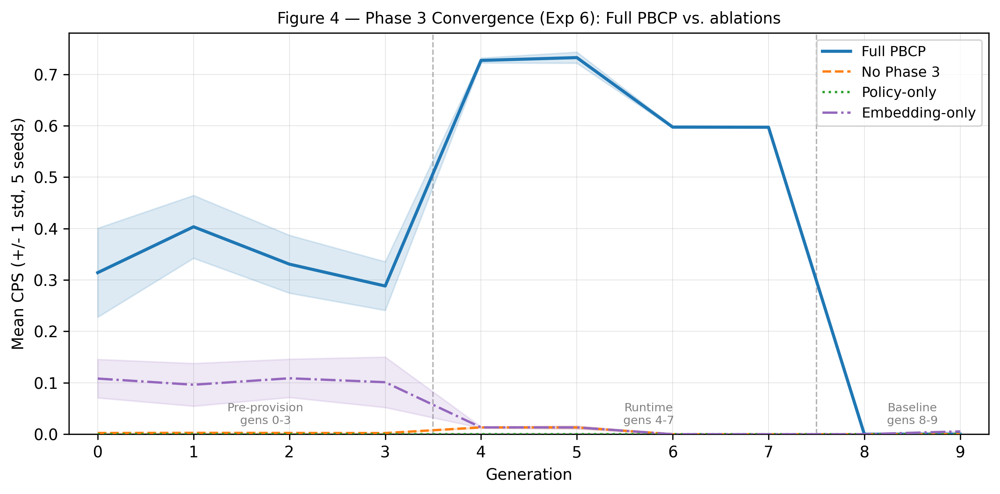

# PBCP — Pre-Billing Cost Prevention Framework

> Intent-aware cloud governance system that prevents compute waste before billing using hybrid NLP, FAISS KNN retrieval, and decision-theoretic intervention.

<div align="center">


[](https://intent-aware-cloud-governance.streamlit.app/)
[](IACG_Design_Document.md)
[](docs/EXPERIMENTS.md)
[](./)

</div>

> PBCP is a controlled cloud systems research prototype and evaluation benchmark. It is not a production governance platform. Production deployment would require calibration against an organization's own telemetry and enforcement stack.

[](https://intent-aware-cloud-governance.streamlit.app/)

<!-- Add assets/pbcp_live_demo.gif here after recording a short Streamlit walkthrough -->

## What PBCP Does

- Infers workload intent from natural-language descriptions.
- Predicts waste before provisioning through retrieval and pre-execution simulation.
- Applies `BLOCK` / `AUTO_CORRECT` / `SUGGEST` / `PASS` decisions before or during execution.
- Tracks impact using CPS, ESR, and IFS.

## Why This Matters

A concise example: a team submits a 20-node cluster for a short ETL workload. The job finishes, but the cluster stays idle and cost is already incurred by the time a traditional FinOps alert appears. PBCP intervenes earlier by blocking or auto-correcting the request before billing.

## Architecture

PBCP is organized around a simple loop: **Prevent -> Correct -> Learn**.

```text
Natural Language Workload
→ Intent Inference
→ FAISS KNN Retrieval
→ Pre-Execution Simulation
→ EV Decision Engine
→ Runtime Optimizer
→ CPS + IFS Tracking
→ Policy Learning Loop
```

- **Prevent**: infer workload intent, retrieve similar historical cases, simulate likely waste, and choose an intervention.
- **Correct**: apply runtime actions when observed behavior diverges from declared intent.
- **Learn**: update policies and improve prevention quality over repeated generations.

## Evaluation Notes

- **IFS** is the cosine similarity between intent embeddings and behavior embeddings.
- Dashboard sub-scores provide interpretability only.

## Key Results

| Experiment | Result |
| --- | --- |
| Calibration | Utilization MAE 0.054 |
| Pre-Provision | Showcase CPS 0.500 |
| Runtime | $97.92 prevented in runaway ML scenario |
| IBD Detection | IFS F1 0.761 vs CPU baseline 0.605 |
| System Roll-up | Valid CPS 0.559 · ESR 0.981 |
| Convergence | Peak CPS 0.733 · 58× vs no-Phase-3 |

## Dashboard

| Overview | Prevention Engine |
| --- | --- |
| [](https://intent-aware-cloud-governance.streamlit.app/) | [](https://intent-aware-cloud-governance.streamlit.app/) |

| Runtime & Savings | Learning System |
| --- | --- |
| [](https://intent-aware-cloud-governance.streamlit.app/) | [](https://intent-aware-cloud-governance.streamlit.app/) |

## Quick Start

```bash
git clone https://github.com/Keerthi-Rapolu/intent-aware-cloud-governance.git
cd intent-aware-cloud-governance
pip install -r requirements.txt

# Generate dataset
python data/generate_dataset.py

# Run benchmark
python -m evaluation.benchmark

# Launch Streamlit
streamlit run app/app.py
```

## Repository Structure

- `intent_model/`
- `simulation_engine/`
- `policy_engine/`
- `runtime_optimizer/`
- `cps_metrics/`
- `experiments/`
- `app/`
- `data/`
- `config/`

## Further Reading

- [Technical Details](docs/TECHNICAL_DETAILS.md)
- [Experiments](docs/EXPERIMENTS.md)
- [Dashboard Guide](docs/DASHBOARD_GUIDE.md)

## Citation

```bibtex
@misc{rapolu2026pbcp,
  title  = {PBCP: A Pre-Billing Cost Prevention Framework for Intent-Aware Cloud Governance},
  author = {Rapolu, Keerthi and Katta, Sreeja},
  year   = {2026},
  note   = {IACG v2.0 Research Prototype}
}
```
